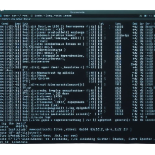

### Utilidades de consola AVANZADA

AConsole o ADVANCED console son un conjunto de rutinas que permiten mejorar o facilitar la creación
de aplicaciones de consola.
Por ahora los paquetes son los siguientes:

+ **AConsole**: Contiene todos los paquetes y las funciones
  avanzadas de entrada/salida que admiten verificadores.
+ **commandline**: Proporciona una manera sencilla de procesar opciones en línea de comandos, con parámetros
  y subparámetros.
+ **datatable**: Clases que permiten formatear tablas de datos de forma ordenada, paginada y pudiendo hacer resumenes.
+ **optionList**: Permite crear menús de consola con opciones elegibles.
+ **verificators**: Objetos de verificación de tipo de dato para la función Input avanzada.
+ **common**: Funciones comúnes y variadas.

Recomendamos echar un vistazo al JAVADOC de la libreria para poderla utilizar eficientemente.

El proyecto del repositorio DEJA-ACONSOLE-DEMO muestra un ejemplo combinado de ENTRADA/SALIDA y tablas
formateadas usando DEJA contra la tabla de una base de datos de prueba.

